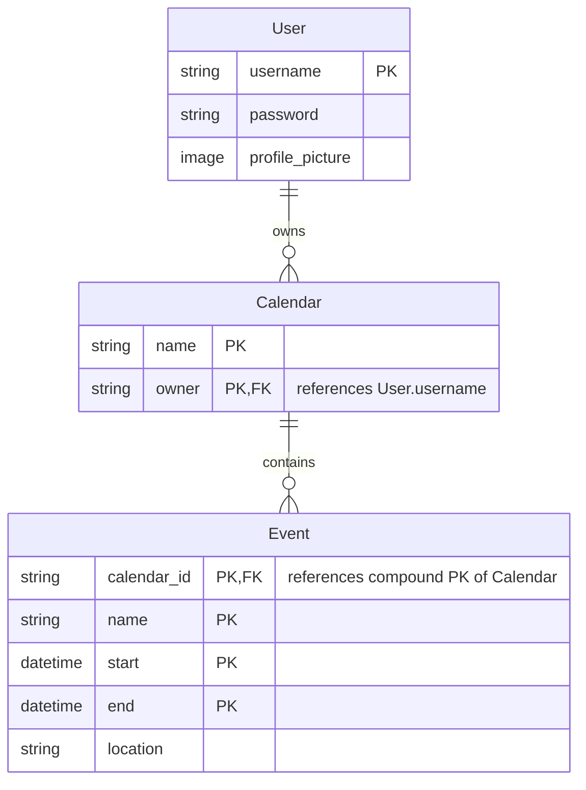
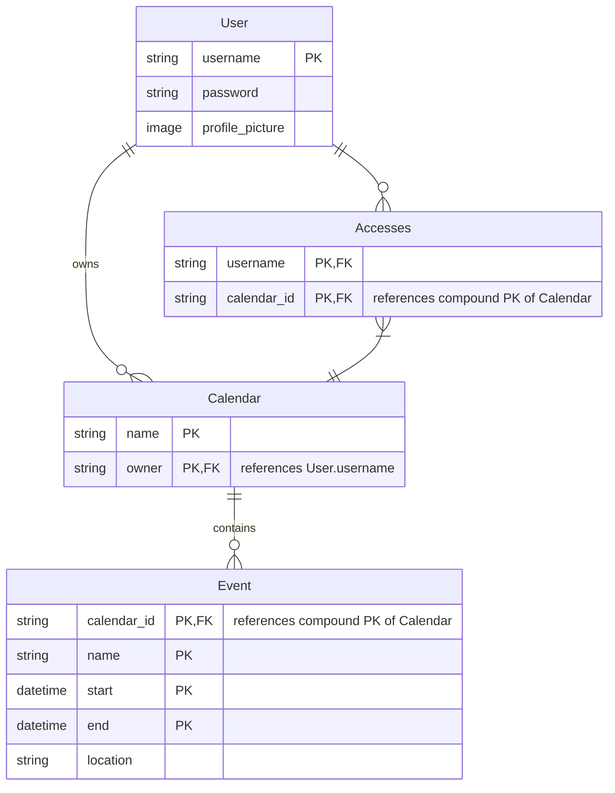

# TimeFrame

TimeFrame is a calendar app

## Entity Relationship Diagram (ERD)

The initial and most basic structure of our database is depicted below; it shows one user owning zero or more Calendar, and one calendar containg zero or more Event. This should not be a challenge for us to implement.

A new ERD shows a more complex relationship between User and Calendar; one user *owns* zero or more calendars, but one or more users *access* zero or more calendars. The reason the 'accesses' relationship has one mandatory user is because an owner themself is an accessor.

