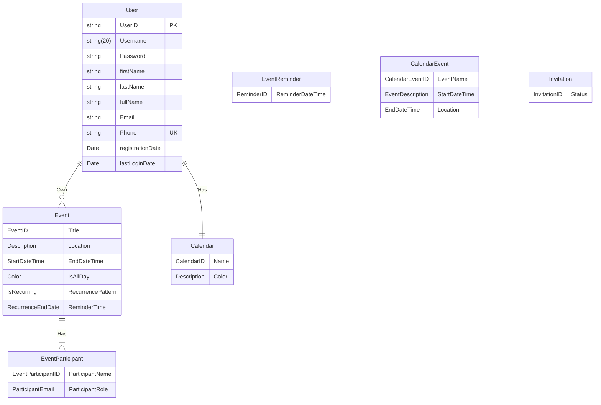

# TimeFrame

## TimeFrame is a Calendar app

```mermaid
erDiagram
  User {
    string UserID PK
    string(20) Username
    string Password
    string firstName
    string lastName
    string fullName
    string Email
    string Phone UK
    Date registrationDate
    Date lastLoginDate
    
  }

  Event {
    EventID
    Title
    Description
    Location
    StartDateTime
    EndDateTime
    Color
    IsAllDay
    IsRecurring
    RecurrencePattern
    RecurrenceEndDate
    ReminderTime
  }

  EventParticipant {
    EventParticipantID
    ParticipantName
    ParticipantEmail
    ParticipantRole
}
  EventReminder{
    ReminderID
    ReminderDateTime
  }

  Calendar{
    CalendarID
    Name
    Description
    Color
  }

  CalendarEvent {
    CalendarEventID
    EventName
    EventDescription
    StartDateTime
    EndDateTime
    Location
}

  Invitation {
    InvitationID
    Status
  }

  User ||--o{ Event : Own

  User ||--|| Calendar : Has

  Event ||--|{ EventParticipant: Has


```
